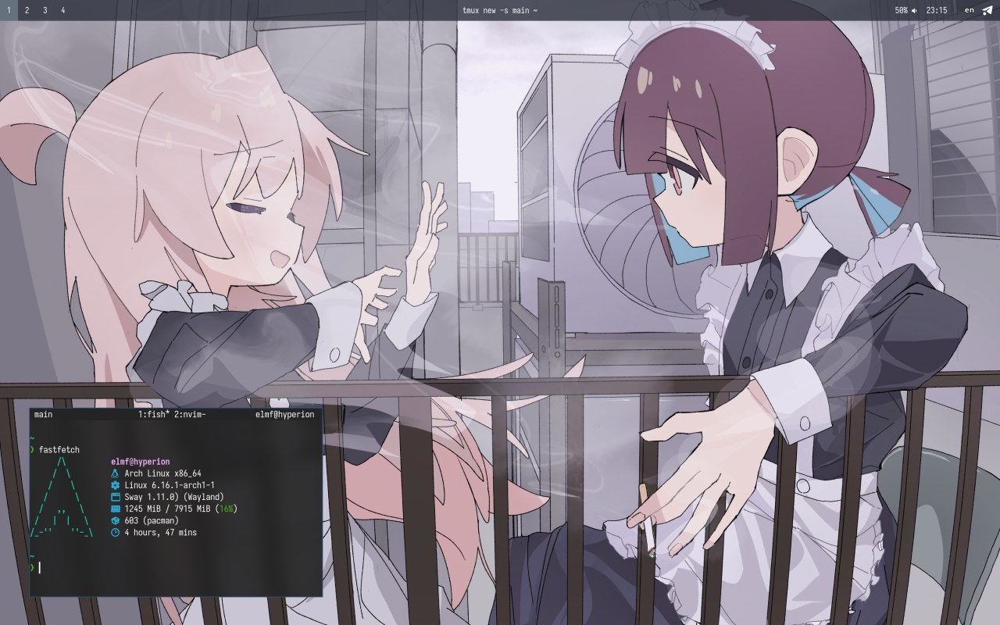
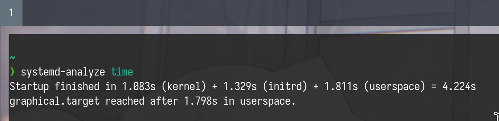

有了电脑后当然是要装系统啦！我目前使用了一周 Arch Linux，以下是我的使用体验：

### 为什么选择它呢？

至于这个问题，我的原因有以下几点 ~~（微软，对比的就是你！）~~：

- 它足够轻量，没有多余的背景任务
- 它的可定制性很强，想对你的系统做什么就能做什么
- 它没有内建任何追踪器和广告，非常隐私友好
- 它基于开源软件，我很喜欢这种自由精神
- 它是类 UNIX 系统，学习编程很方便
- 它采取滚动的更新包的策略，随时随刻都能体验到最新的软件版本
- 可以大喊 `btw I use Arch`！

### 安装及配置

大家都说 Arch Linux 的安装过程很难，但其实我觉得其实只要认真跟随 Arch Wiki 一切就会变得很简单。
Wiki 里记录了详细的安装指南，并且还收录很多其他知识，是萌新的好帮手！

- 分区选择 Btrfs，相对于 ext4 提供了透明压缩、CoW、子卷、文件快照等现代功能。

- 由于我是 UEFI 系统，我使用了 systemd-boot 这款 bootloader，它足够简单而且不需要安装额外的包裹，所以我更偏好它而不是 grub。

- [~~由于我的底裤已经交给 systemd 了~~](https://syste.md)，于是我顺便换成了 systemd-based initramfs，详见 [Mkinitcpio](https://wiki.archlinux.org/title/Mkinitcpio)。

- 我上手选择了 sway 窗口管理器，我很喜欢平铺窗口的概念，实际上用下来管理窗口十分顺手。同时 Wayland 也足够现代，我认为它比 X11 的可用性好很多。

- Neovim！我很早就听说了这款文本编辑器，如果使用得当效率会非常高，可定制性也足够强，与 tmux 搭配使用更佳。

- 我的配置目前使用 stow 管理，上传到了 [GitHub](https://github.com/ElmForestW/dotfiles)。

- 还有很多的实用小软件，如 paru、fish、starship、fzf、zoxide、lazygit。在这里不一一赘述。

### 截图

